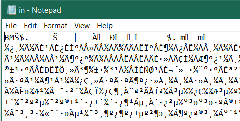
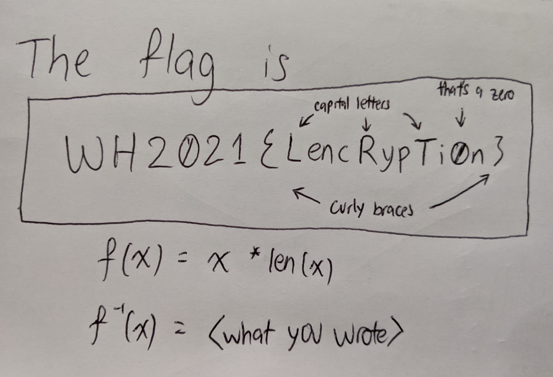
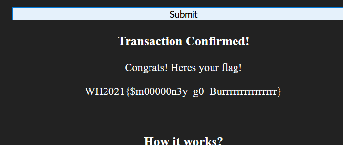

### :closed_lock_with_key: Crypto: All challenges :closed_lock_with_key:

by burden_bear

#### BasedRSA 

###### Flag

`WH2021{BASED_R5A_1N_BASE_64_Is_BASICALY_BASIC}`

###### Challenge Summary

We're given an RSA public key and an encrypted message. We need to get the decrypted message, which contains the flag.

###### Steps

From the title, we can guess that **bases** are going to be important. Let's first import the files.

```python
from Crypto.PublicKey import RSA

with open("key.pub") as f:
    key = RSA.import_key(f.read())
    
n = key.n
e = key.e

print(n)
#40796440680201269792646590394188926428840469491352...
print(e)
#65537
```

Hmm, nothing too special. We know that `e` is common, so it's unlikely to be the point of attack. Let's instead look at `n` in **hex**.

```python
print(hex(n))
#0x10000000000000000000001000030000000000000001000003000010000000000100010000001000000000000000000030000000000000001000000030010000300000000000000000091030000000000003000000100033000000000000030100000800001000000000010090000000700000003000000020030000b0020000000000000020000000063000000000001002060000300020010002...
```

Huh, cool. It's mostly 0s. Maybe we can try to rewrite `n` in terms of a polynomial in 16, then factor the polynomial!

Let's pull out sage for this.

```python
poly = sum([coeff * x^power for power, coeff in enumerate(n.digits(16))])
print(poly)
#x^1022 + x^1000 + 3*x^995 + x^979 + 3*x^973 + x^968 + x^957 + x^953 + x^946 + 3*x^926 + x^910 + 3*x^902 + x^899 + 3*x^894 + 9*x^875 + x^874 + 3*x^872 + 3*x^859 + x^852...

#moment of truth
factor(poly)
#(x^511 + x^489 + x^442 + 3*x^391 + ...)*(x^511 + 3*x^484 + x^468 + ...)
```

!!! it works !!!

Now all we have to do is substitute `x=16` into each of the factors to get `p` and `q`.

```python
(p,_), (q,_) = factor(poly).factor_list()
p, q = p.subs(x=16), q.subs(x=16)
```

The rest is left as an exercise for the reader :wink:

I found out after that the intended base to factor was Base64, which would have been revealed by looking at the pub file. Many characters of the pub file were `A`, implying 0s in base 64. TIL! 

#### LENcrypt

###### Flag

`WH2021{LencRypTi0n}`

###### Challenge Summary

We're given a short python script which encodes a file. We're given an output of this script, and need to find the original file, which contains the flag. 

###### Steps

The meat of the "encryption" is done in these lines:

```python
with open(infile, 'rb') as f:
    data = f.read()
    
# LENcrypt!
password = len(data)

encoded = int(binascii.hexlify(data), 16) * password
```

Essentially, we're given some bytes, and the encoded value is the length of the bytes multiplied by its integer representation. We can think of this as:
$$
\text{enc}(x) = x \ \log_{256}(x)
$$
That doesn't seem too bad! Let's take $\log_{256}$ on both sides.
$$
\log_{256}\text{enc}(x) = \log_{256}x + \log_{256}\log_{256}(x) \\
\log_{256}\text{enc}(x) \approx \log_{256}x \\
\text{enc}(x) = x \ \log_{256}(x) \approx x \log_{256}\text{enc}(x) \\
x \approx \frac{\text{enc}(x)}{\log_{256}\text{enc}(x)}
$$
Now we have an approximate solution to $x$. We can just check the neighborhood of this value and find the one which is divisible by $\text{enc}(x)$ to get the true value of $x$. Let's first import the files.

```python
import math
with open("enc", "rb") as f:
    enc = f.read()
    
enc = int.from_bytes(enc, "big")
#Warning: c is huge! don't print c directly.
print(math.log(enc, 10))
#88089672.86975917
```

beeg. That's bigger than 1 followed by 88089672 zeroes! Now we can invert the encoding.

```python
approx = enc//int(math.log(enc, 256))

#check neighborhood
for x in range(approx-10, approx+11):
    #if divisible, it's the original input
    if (enc%x == 0):
        #get message, write out
        message = enc//x
        with open("in", "wb+") as f:
            mb = message.to_bytes((message.bit_length() + 7) // 8, byteorder='big')
            f.write(mb)
```

There! We now have our flag file. Sadly, it's not that simple. 



The original file doesn't seem to contain the flag at all In fact, there exists no occurrence of "WH" in the entire file. Let's check the file format instead.

```tex
javier@ubuntu:~$ file in
in: PC bitmap, Windows 98/2000 and newer format, 4032 x 3024 x 24
```

An image! Opening this in an image editor, it reveals the flag.

(Nice handwriting btw)

#### SecureBanking

###### Flag

`WH2021{$m00000n3y_g0_Burrrrrrrrrrrrrrr}`

###### Challenge Summary

A signed message is provided to us, which grants us \$20 from Peter. We want to forge a signed message that grants us \$1000000 from the Admin. The message is signed by concatenating a secret and the message, then passing it through SHA256.

###### Steps

This is a classic **Length Extension attack**. For certain hash algorithms, knowing the output of `Hash(message1) ` allows us to compute `Hash(message1 | message2)` without ever knowing what `message1` was. In this case, SHA256 is vulnerable to this attack. Hence, if we can append `from=Admin&amount=1000000` to the message **and** forge its signature, we can send it to the server and win.

`hlextend` makes it easy to carry out the attack. 

```python
import hlextend
import base64

sha = hlextend.new("sha256")

extend = "&from=Admin&amount=1000000"
base = "from=Peter&amount=20"
sec = 19
curr = "24a2efde8a32e7046aaeb11eb32a37ecf49937ef84c7a6b4bd943556fd2369cd"

message = sha.extend(extend, base, sec, curr)
print(message)
#from=Peter&amount=20\x80\x00\x00\x00\x00\x00\x00\x00\x00\x00\x00\x00\x00\x00\x00\x00\x00\x00\x00\x00\x00\x00\x00\x018&from=Admin&amount=1000000

#or in Base64,
#ZnJvbT1QZXRlciZhbW91bnQ9MjCAAAAAAAAAAAAAAAAAAAAAAAAAAAAAAAE4JmZyb209QWRtaW4mYW1vdW50PTEwMDAwMDA=

print(sha.hexdigest())
#3ac04e9e4a435072edf4961702a6eddb9cf52a3387019006119d05af98a17ebc
```

Sending the Base64 encoded string and the new forged signature, we get the flag!

